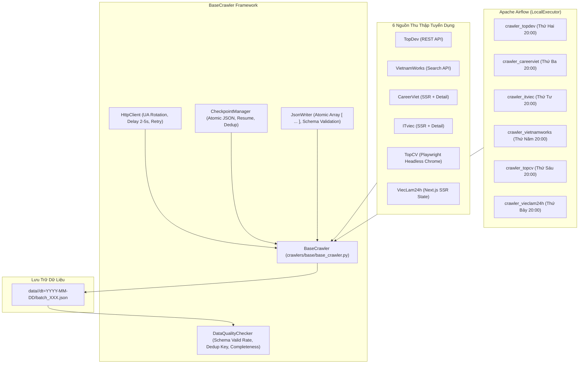

# **VN IT Job Mining Data Collection System**

Hệ thống thu thập dữ liệu tuyển dụng IT tự động tại Việt Nam, orchestrate bằng **Apache Airflow**, lưu trữ dữ liệu dạng **JSON mảng phân vùng (partitioned)**, kiểm soát chất lượng dữ liệu (**DataQualityChecker**) và chuẩn hóa theo **Data Contract Schema v1**.

---

## 🏛️ Kiến Trúc Hệ Thống



---

## 📐 Data Contract & Unified Schema v1

Toàn bộ dữ liệu sau khi thu thập được chuẩn hóa theo định dạng **Compact Schema v1** ([`crawlers/common/schema.py`](crawlers/common/schema.py)), loại bỏ các trường HTML thô và văn bản trùng lặp để tối ưu dung lượng lưu trữ:

### Cấu Trúc Record Chuẩn:
```json
{
  "_meta": {
    "source": "topcv",
    "source_job_id": "2157137",
    "url": "https://www.topcv.vn/viec-lam/2157137.html",
    "dedup_key": "topcv:2157137",
    "crawled_at": "2026-10-09T09:02:58Z",
    "batch_id": "2026-10-09_topcv_001",
    "crawler_version": "0.5.0",
    "language": "vi"
  },
  "raw": {
    "title": "Business Analyst - YC 3 Năm KN - Ưu Tiên CCBA",
    "company": "TỔNG CÔNG TY GIẢI PHÁP DOANH NGHIỆP VIETTEL",
    "salary": {
      "salary_text": "25 - 60 triệu",
      "salary_min": 25.0,
      "salary_max": 60.0,
      "salary_currency": "VND",
      "pay_period": "month",
      "is_negotiable": false,
      "has_commission": false
    },
    "tags": {
      "requirements": ["3 năm kinh nghiệm chuyên môn", "Đại Học trở lên", "Tiếng Anh TOEIC 650"],
      "benefits": null,
      "skills": ["Business Analyst (Phân tích nghiệp vụ)", "IT - Phần mềm"]
    },
    "description_list": [
      "Xây dựng giải pháp nghiệp vụ đối với dự án nâng cấp...",
      "Quản lý tiến độ dự án..."
    ],
    "requirements_list": [
      "Tốt nghiệp Đại học chuyên ngành CNTT...",
      "Có tối thiểu 3 năm kinh nghiệm ở vị trí ứng tuyển..."
    ],
    "benefits_list": [
      "Lương thưởng cạnh tranh trên thị trường...",
      "Chế độ chăm sóc y tế đặc biệt..."
    ],
    "location_text": "Hà Nội",
    "deadline_text": "09/10/2026",
    "employment_type_text": "Toàn thời gian",
    "seniority_text": "Nhân viên",
    "extra": {
      "work_schedule": "Thứ 2 - Thứ 6 (08:00 - 17:30)",
      "education": "Đại Học trở lên"
    }
  }
}
```

---

## 📊 Ma Trận Đối Chiếu Trường Dữ Liệu 6 Nguồn Tuyển Dụng

Để thống nhất Schema v1 trên toàn hệ thống, dưới đây là bảng đối chiếu khả năng trích xuất của từng nguồn:

| Trường Dữ Liệu | TopCV | TopDev | ITviec | VietnamWorks | CareerViet | ViecLam24h | Quy Chuẩn Schema v1 |
|:---|:---:|:---:|:---:|:---:|:---:|:---:|:---|
| **`title`** | ✅ H1 | ✅ API | ✅ JSON-LD | ✅ API | ✅ DOM | ✅ SSR State | `str` (Bắt buộc) |
| **`company`** | ✅ Label | ✅ API | ✅ JSON-LD | ✅ API | ✅ DOM | ✅ SSR State | `str` (Bắt buộc) |
| **`salary`** | ✅ Lồng | ⚠️ Text | ⚠️ Gated/Text | ✅ Min/Max | ⚠️ Text | ⚠️ Text/Range | `JobSalary` (Lồng chuẩn) |
| **`tags.requirements`** | ✅ Nhóm riêng | ⚠️ Thuộc tính | ⚠️ Gộp chung | ⚠️ Gộp chung | ⚠️ Gộp chung | ⚠️ Gộp chung | `list[str] \| null` |
| **`tags.benefits`** | ✅ (null nếu thiếu)| ⚠️ Icon | ⚠️ Gộp chung | ⚠️ Tag phúc lợi | ⚠️ Icon phúc lợi | ⚠️ Tag | `list[str] \| null` |
| **`tags.skills`** | ✅ Chuyên môn | ✅ Tech stack | ✅ Key skills | ✅ Skills tag | ✅ Kỹ năng | ✅ Kỹ năng | `list[str] \| null` |
| **`description_list`** | ✅ (`list[str]`) | HTML/Text | Text | HTML/Text | HTML/Text | Text | `list[str]` (Bắt buộc) |
| **`requirements_list`**| ✅ (`list[str]`) | List/Text | Section text | HTML/Text | Section text | List/Text | `list[str] \| null` |
| **`benefits_list`** | ✅ (`list[str]`) | Text | Section text | HTML/Text | Section text | List/Text | `list[str] \| null` |
| **`location_text`** | ✅ Địa điểm | ✅ Addresses | ✅ JobLocation | ✅ City | ✅ Tỉnh thành | ✅ Tỉnh/Thành | `str \| null` |
| **`deadline_text`** | ✅ Deadline | ⚠️ | ⚠️ | ✅ Expired date | ✅ Hạn nộp | ✅ Hạn nộp | `str \| null` |

> [!TIP]
> **Bộ thích ứng tương thích ngược (Smart Ingestion)**: `crawlers/common/schema.py` được trang bị `@model_validator(mode="before")` giúp tự động chuyển đổi các crawler đang xuất định dạng cũ (flat salary, `description_text`, `skills_text`) sang cấu trúc chuẩn mà không làm vỡ hệ thống hay gãy pipeline Airflow.

---

## 📦 Cài Đặt & Chạy Thử Nghiệm

### 1. Kích hoạt môi trường
```bash
source .venv/bin/activate
export PYTHONPATH=.
```

### 2. Chạy thử nghiệm từng crawler riêng lẻ (Single File .py)
Mỗi nguồn được đóng gói gọn trong đúng **1 file duy nhất** tại `crawlers/sources/<source>/crawler.py`:

```bash
# TopCV (Playwright - Mặc định không lưu HTML rác)
python crawlers/sources/topcv/crawler.py --max-items 30

# TopDev (REST API)
python crawlers/sources/topdev/crawler.py --max-items 30

# VietnamWorks (Search API)
python crawlers/sources/vietnamworks/crawler.py --max-items 50

# CareerViet (SSR)
python crawlers/sources/careerviet/crawler.py --max-items 30

# ViecLam24h (SSR State)
python crawlers/sources/vieclam24h/crawler.py --max-items 30

# ITviec (SSR + Detail)
python crawlers/sources/itviec/crawler.py --max-items 30
```

### 3. Xem báo cáo tiến độ thu thập
```bash
python scripts/report.py
```

### 4. Chạy Toàn Bộ Unit Tests
```bash
pytest
```
Toàn bộ **110/110 test cases** đạt trạng thái **100% Passed**.

---

## 📚 Tài Liệu Hướng Dẫn & Bộ AI Skill

- **Quy trình chuẩn bóc tách nguồn dữ liệu mới**: [`docs/crawl_documents/01_crawler_analysis_methodology.md`](docs/crawl_documents/01_crawler_analysis_methodology.md)
- **Nhật ký prompt thực chiến & Tư duy tiến hóa**: [`docs/crawl_documents/02_user_prompt_logs_and_insights.md`](docs/crawl_documents/02_user_prompt_logs_and_insights.md)
- **Case Study chi tiết TopCV**: [`docs/crawl_documents/03_case_study_topcv.md`](docs/crawl_documents/03_case_study_topcv.md)
- **Antigravity Custom Skill cho AI**: [`.agents/skills/job-crawler-analyzer/SKILL.md`](.agents/skills/job-crawler-analyzer/SKILL.md)

---

## 🕒 Rotating Daily Schedule trên Airflow
| Ngày | Nguồn | DAG ID | Lịch Chạy |
|:---|:---|:---|:---|
| Thứ Hai | **TopDev** | `crawler_topdev` | `0 20 * * 1` |
| Thứ Ba | **CareerViet** | `crawler_careerviet` | `0 20 * * 2` |
| Thứ Tư | **ITviec** | `crawler_itviec` | `0 20 * * 3` |
| Thứ Năm | **VietnamWorks** | `crawler_vietnamworks` | `0 20 * * 4` |
| Thứ Sáu | **TopCV** | `crawler_topcv` | `0 20 * * 5` |
| Thứ Bảy | **ViecLam24h** | `crawler_vieclam24h` | `0 20 * * 6` |
