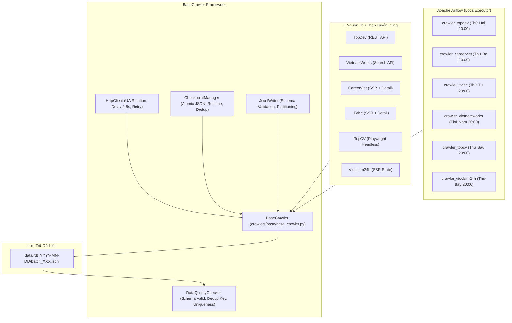

# **VN IT Job Mining Data Collection System**

Hệ thống thu thập dữ liệu tuyển dụng IT tự động tại Việt Nam, orchestrate bằng **Apache Airflow**, lưu trữ dữ liệu dạng **JSONL phân vùng (partitioned)** và kiểm soát chất lượng dữ liệu trước khi nạp vào kho dữ liệu.

---

## 🏛️ Kiến Trúc Hệ Thống



---

## 📦 Cài Đặt & Chạy Thử Nghiệm

### 1. Kích hoạt môi trường
```bash
source .venv/bin/activate
export PYTHONPATH=.
```

### 2. Chạy thử nghiệm từng crawler riêng lẻ (Single File .py)
Mỗi nguồn được đóng gói gọn trong đúng **1 file duy nhất** tại `crawlers/sources/<source>/crawler.py`:

```bash
# TopDev
python crawlers/sources/topdev/crawler.py --max-items 30

# VietnamWorks
python crawlers/sources/vietnamworks/crawler.py --max-items 50

# CareerViet
python crawlers/sources/careerviet/crawler.py --max-items 30

# ViecLam24h
python crawlers/sources/vieclam24h/crawler.py --max-items 30

# ITviec
python crawlers/sources/itviec/crawler.py --max-items 30
```

### 3. Xem báo cáo tiến độ thu thập
```bash
python scripts/report.py
```

### 4. Chạy Unit Tests & Test Coverage
```bash
pytest --cov=crawlers/common --cov=crawlers/base tests/unit
```
Toàn bộ 78 test cases đạt trạng thái **100% Passed**, Coverage **≥ 75%**.

---

## 🕒 Rotating Daily Schedule trên Airflow
| Ngày | Nguồn | DAG ID | Lịch Chạy |
|:---|:---|:---|:---|
| Thứ Hai | **TopDev** | `crawler_topdev` | `0 20 * * 1` |
| Thứ Ba | **CareerViet** | `crawler_careerviet` | `0 20 * * 2` |
| Thứ Tư | **ITviec** | `crawler_itviec` | `0 20 * * 3` |
| Thứ Năm | **VietnamWorks** | `crawler_vietnamworks` | `0 20 * * 4` |
| Thứ Sáu | **TopCV** | `crawler_topcv` | `0 20 * * 5` |
| Thứ Bảy | **ViecLam24h** | `crawler_vieclam24h` | `0 20 * * 6` |

Xem hướng dẫn chi tiết tại:
- [Hướng dẫn thiết lập Airflow](docs/airflow_setup_guide.md)
- [Checklist báo cáo demo với thầy](docs/demo_checklist.md)
