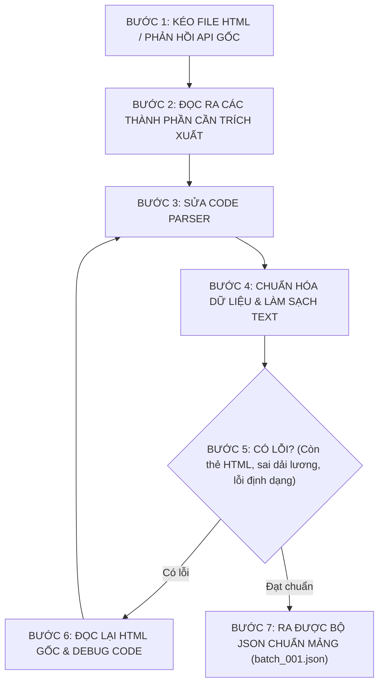

# 📋 Implementation Plan & Bảng Phân Công Nhiệm Vụ (VN-IT-Job-Mining)

> **Dự án**: VN-IT-Job-Mining — Thu thập, Chuẩn hóa & Khai phá Dữ liệu Tuyển dụng CNTT Việt Nam  
> **Cập nhật ngày**: 2026-10-08  
> **Đối tượng**: Toàn bộ 7 thành viên trong nhóm nghiên cứu (UTH)  
> **Tài liệu phân tích API tham chiếu**: [`docs/crawler_api_analysis.md`](file:///home/billtran/Desktop/Learning/UTH/VN-IT-Job-Mining/docs/crawler_api_analysis.md)

---

## 🎯 1. Mục Tiêu & Bối Cảnh Nâng Cấp Hệ Thống

Dự án bước vào giai đoạn then chốt: **Chuẩn hóa chất lượng dữ liệu thu thập từ 7 sàn tuyển dụng CNTT hàng đầu và thực hiện Phân tích Khám phá Dữ liệu (EDA) chuẩn mực học thuật**.

### ⚠️ Các vấn đề kỹ thuật cấp bách cần giải quyết:
1. **Định dạng file đầu ra**: Chuyển đổi toàn bộ cơ chế lưu trữ từ `.jsonl` sang file **`.json` chuẩn dạng mảng đối tượng** (`[ { "_meta": ..., "raw": ... }, ... ]`, uncompressed UTF-8 plain text) để tương thích hoàn toàn với tài liệu phân tích API và `json.load()` trong Python.
2. **Dọn sạch thẻ HTML & Chuẩn hóa ngắt dòng**: Loại bỏ triệt để các thẻ `<p>`, `<span>`, `<div>`, `<strong>` trong các trường mô tả (`description_text`), yêu cầu (`requirements_text`), phúc lợi (`benefits_text`). Chuẩn hóa các chuỗi dính nhau dạng `AA,\nBB` thành định dạng xuống dòng sạch đẹp:
   ```text
   AA,
   BB
   ```
3. **Bóc tách trường Lương số học**: Chuẩn hóa rõ ràng `salary_min` (float), `salary_max` (float), và `salary_currency` (`VND`, `USD`) để phục vụ vẽ biểu đồ phân phối và hồi quy lương.
4. **Tính toán ngày đăng tin bài**: Với các nguồn không hiển thị ngày đăng cụ thể mà hiển thị hạn nộp hồ sơ hoặc thời gian còn lại (ví dụ *"còn 14 ngày"*), thực hiện công thức suy luận ngày đăng: `ngày đăng = ngày cào - (30 - số ngày còn lại)`.
5. **Định danh Ngôn ngữ (`language`)**: Bổ sung trường `language: "vi" | "en"` trong `_meta` để phân loại bài tuyển dụng tiếng Anh hay tiếng Việt.
6. **Mở rộng nguồn mới**: Bổ sung thành viên **Duy** phụ trách xây dựng crawler mới cho sàn **Glints Vietnam** ([`https://glints.com/vn`](https://glints.com/vn)).
7. **Chuyên môn hóa EDA**: Phân công **Tài** và **Khoa** chuyên trách 100% việc trực quan hóa biểu đồ và mô tả dữ liệu chuyên sâu theo mô hình 3 bước (Số liệu -> Nguyên nhân -> Ý nghĩa thực tiễn).

---

## 👥 2. Bảng Phân Công Nhiệm Vụ 7 Thành Viên (Master Task Matrix)

Nhóm gồm **7 thành viên** được chia thành 2 nhóm chuyên môn:
* **Nhóm Thu Thập & Chuẩn Hóa Dữ Liệu (5 người)**: Thuận (Lead), Sơn, Phát, Phúc, Duy.
* **Nhóm Khai Phá & Trực Quan Hóa EDA (2 người)**: Tài, Khoa.

| STT | Thành viên | Vai trò & Nguồn phụ trách | Nhiệm vụ trọng tâm | File code / Notebook chính | Bản giao việc chi tiết | Trạng thái |
| :---: | :--- | :--- | :--- | :--- | :---: | :---: |
| **1** | **Thuận** *(Bill Tran)* | **Team Lead & Data Platform** *(TopCV & Core)* | Nâng cấp `crawlers/common` & `base` sang mảng `.json`, thêm `language` meta, bóc tách lương/HTML cho TopCV, viết script merge dữ liệu 7 nguồn. | [`crawlers/sources/topcv/crawler.py`](file:///home/billtran/Desktop/Learning/UTH/VN-IT-Job-Mining/crawlers/sources/topcv/crawler.py)<br>[`crawlers/common/schema.py`](file:///home/billtran/Desktop/Learning/UTH/VN-IT-Job-Mining/crawlers/common/schema.py) | [📄 `tasks/thuan.md`](tasks/thuan.md) | 🟡 **ĐANG TRIỂN KHAI** |
| **2** | **Sơn** | **Crawler Developer** *(TopDev)* | Bóc tách TopDev REST API, dọn sạch tag HTML trong requirements & benefits, chuẩn hóa ngắt dòng `AA,\nBB`, trích xuất `salary_min/max`, detect `language`. | [`crawlers/sources/topdev/crawler.py`](file:///home/billtran/Desktop/Learning/UTH/VN-IT-Job-Mining/crawlers/sources/topdev/crawler.py) | [📄 `tasks/son.md`](tasks/son.md) | 🟡 **ĐANG TRIỂN KHAI** |
| **3** | **Phát** | **Crawler Developer** *(ITviec)* | Chuyển ITviec sang ghi mảng `.json`, dọn sạch thẻ `<p>` trong 4 sections HTML/Text, trích xuất lương USD/VND, tính ngày đăng từ hạn nộp, detect `language`. | [`crawlers/sources/itviec/crawler.py`](file:///home/billtran/Desktop/Learning/UTH/VN-IT-Job-Mining/crawlers/sources/itviec/crawler.py)<br>[`crawlers/sources/itviec/parser.py`](file:///home/billtran/Desktop/Learning/UTH/VN-IT-Job-Mining/crawlers/sources/itviec/parser.py) | [📄 `tasks/phat.md`](tasks/phat.md) | 🟡 **ĐANG TRIỂN KHAI** |
| **4** | **Phúc** | **Crawler Developer** *(Việc Làm 24h)* | Làm sạch thẻ HTML SSR Next.js, tách dòng `AA,\nBB`, tính ngày đăng từ deadline ("14 days left"), chuẩn hóa lương triệu VNĐ, gán `language: "vi"`. | [`crawlers/sources/vieclam24h/crawler.py`](file:///home/billtran/Desktop/Learning/UTH/VN-IT-Job-Mining/crawlers/sources/vieclam24h/crawler.py) | [📄 `tasks/phuc.md`](tasks/phuc.md) | 🟡 **ĐANG TRIỂN KHAI** |
| **5** | **Duy** *(Mới)* | **Crawler Developer** *(Glints Vietnam)* | Xây dựng Crawler mới cho sàn Glints (`crawlers/sources/glints/`), bóc tách lương min/max, skills, dọn sạch HTML, tích hợp vào `run.py`, xuất mảng `.json`. | [`crawlers/sources/glints/crawler.py`](file:///home/billtran/Desktop/Learning/UTH/VN-IT-Job-Mining/crawlers/sources/glints/crawler.py)<br>[`run.py`](file:///home/billtran/Desktop/Learning/UTH/VN-IT-Job-Mining/run.py) | [📄 `tasks/duy.md`](tasks/duy.md) | 🟡 **ĐANG TRIỂN KHAI** |
| **6** | **Tài** | **Data Analyst / EDA Lead 1** *(Salary & Market)* | Chuyên đề EDA 1: Phân tích chất lượng dữ liệu missing value, phân phối mức lương (Min/Max/Range theo VND/USD), dải lương theo cấp bậc & kinh nghiệm. | [`notebooks/01_eda_salary_and_market_structure.ipynb`](file:///home/billtran/Desktop/Learning/UTH/VN-IT-Job-Mining/notebooks/01_eda_salary_and_market_structure.ipynb)<br>[`docs/eda_salary_report.md`](file:///home/billtran/Desktop/Learning/UTH/VN-IT-Job-Mining/docs/eda_salary_report.md) | [📄 `tasks/tai.md`](tasks/tai.md) | 🟡 **ĐANG TRIỂN KHAI** |
| **7** | **Khoa** | **Data Analyst / EDA Lead 2** *(Skills & NLP)* | Chuyên đề EDA 2: Phân tích Top kỹ năng công nghệ, Ma trận đồng xuất hiện tech stack, phân bố địa lý (HCM vs HN vs ĐN), Text Mining JD & Phúc lợi. | [`notebooks/02_eda_skills_geo_textmining.ipynb`](file:///home/billtran/Desktop/Learning/UTH/VN-IT-Job-Mining/notebooks/02_eda_skills_geo_textmining.ipynb)<br>[`docs/eda_skills_nlp_report.md`](file:///home/billtran/Desktop/Learning/UTH/VN-IT-Job-Mining/docs/eda_skills_nlp_report.md) | [📄 `tasks/khoa.md`](tasks/khoa.md) | 🟡 **ĐANG TRIỂN KHAI** |

---

## 🔄 3. Quy Trình Bắt Buộc Khi Làm Crawler (The Golden Pipeline)

Mọi thành viên thuộc nhóm Collect Data (Thuận, Sơn, Phát, Phúc, Duy) bắt buộc phải tuân theo chu trình 7 bước khép kín:



---

## 🏛️ 4. Kiến Trúc Hệ Thống Thu Thập Dữ Liệu (7 Nguồn Chuẩn)

```text
VN-IT-Job-Mining/
├── crawlers/
│   ├── base/
│   │   ├── __init__.py
│   │   └── base_crawler.py               # Abstract Class xuất ra mảng JSON
│   ├── common/
│   │   ├── checkpoint.py                 # Checkpoint chống cào trùng lặp
│   │   ├── data_quality.py               # Kiểm tra tính hợp lệ dữ liệu JSON
│   │   ├── http_client.py                # HTTP client xoay vòng UA, backoff delay
│   │   ├── json_writer.py                # Ghi file batch_XXX.json mảng [ ... ] an toàn
│   │   ├── logger.py                     # Logger chuẩn hoá
│   │   ├── schema.py                     # Schema JobRecord, JobMetadata, JobRaw
│   │   └── utils.py                      # strip_html_tags, clean_text, detect_language
│   └── sources/
│       ├── topdev/crawler.py             # Sơn phụ trách
│       ├── vietnamworks/crawler.py       # Crawler có sẵn (API Search POST)
│       ├── careerviet/crawler.py         # Crawler có sẵn (HTML SSR)
│       ├── itviec/crawler.py             # Phát phụ trách
│       ├── vieclam24h/crawler.py         # Phúc phụ trách
│       ├── topcv/crawler.py              # Thuận phụ trách (Playwright headless)
│       └── glints/crawler.py             # Duy phụ trách (Nguồn mới)
├── tasks/                                # Thư mục giao việc chi tiết từng thành viên
│   ├── thuan.md                          # Bản giao việc Thuận (Leader)
│   ├── son.md                            # Bản giao việc Sơn (TopDev)
│   ├── phat.md                           # Bản giao việc Phát (ITviec)
│   ├── phuc.md                           # Bản giao việc Phúc (Việc Làm 24h)
│   ├── duy.md                            # Bản giao việc Duy (Glints)
│   ├── tai.md                            # Bản giao việc Tài (EDA Lương & Cấu trúc)
│   └── khoa.md                           # Bản giao việc Khoa (EDA Kỹ năng & NLP)
├── notebooks/                            # Thư mục chứa Jupyter Notebooks EDA
│   ├── 01_eda_salary_and_market_structure.ipynb
│   └── 02_eda_skills_geo_textmining.ipynb
├── data/
│   └── <source>/dt=YYYY-MM-DD/batch_001.json
└── run.py                                # Giao diện điều phối CLI tập trung
```

---

## 📊 5. Tiêu Chuẩn Trực Quan Hóa & Viết Báo Cáo EDA (Dành Cho Tài & Khoa)

Để bài báo cáo đạt điểm xuất sắc môn Khai phá Dữ liệu, mỗi biểu đồ do Tài và Khoa thực hiện phải tuân thủ nghiêm ngặt **Quy chuẩn 3 Bước**:

1. **Trực quan hóa (Visualization)**:
   * Biểu đồ trực quan, thẩm mỹ, có Title, Labels trục X và Y đầy đủ đơn vị đo lường (triệu VNĐ, năm, số lượng tin).
   * Dùng theme thống nhất: `seaborn.set_theme(style="whitegrid", palette="tab10")`.
2. **Số liệu thực tế (Data Findings)**:
   * Nêu rõ các chỉ số thống kê mô tả: Mean, Median, Min, Max, Độ lệch chuẩn (Std), Khoảng tứ phân vị (IQR), Tỷ lệ phần trăm (%).
3. **Ý nghĩa & Insight thị trường (Actionable Takeaway)**:
   * Phân tích bối cảnh ngành CNTT tại Việt Nam (Vì sao mức lương lệch phải? Vì sao Docker và CI/CD luôn đi kèm nhau? Vì sao TP.HCM chiếm đa số tin tuyển dụng?).
   * Rút ra kết luận có giá trị thực tiễn cho sinh viên hoặc ứng viên tìm việc.

---

## 🌿 6. Quy Chuẩn Git Workflow Cho Cả Nhóm

Tất cả thành viên bắt buộc phải tuân theo quy trình làm việc Git chuẩn sau:

```bash
# BƯỚC 1: Luôn cập nhật code mới nhất từ main trước khi làm việc
git checkout main
git pull origin main

# BƯỚC 2: Tạo nhánh riêng theo định dạng quy ước:
# - Cào dữ liệu: feature/<tên-nguồn>-<tên-bạn>
# - EDA:         feature/eda-<chuyên-đề>-<tên-bạn>
git checkout -b feature/topdev-son

# BƯỚC 3: Làm việc, kiểm tra test và chạy thử dữ liệu
pytest tests/
.venv/bin/python run.py --source <tên-nguồn> --max-items 3

# BƯỚC 4: Kiểm tra trạng thái và commit code đúng quy chuẩn Conventional Commits
git status
git add <các-file-đã-sửa>
git commit -m "feat(<nguồn-hoặc-eda>): mô tả ngắn gọn công việc đã hoàn thành"

# BƯỚC 5: Đẩy nhánh lên GitHub
git push -u origin feature/topdev-son

# BƯỚC 6: Tạo Pull Request (PR) trên GitHub vào nhánh 'main', tag @billtran review và merge
```

---

## 📅 7. Cột Mốc Thời Gian (Timeline Đề Xuất)

| Mốc thời gian | Nhóm Thu thập Dữ liệu (Thuận, Sơn, Phát, Phúc, Duy) | Nhóm Khai phá Dữ liệu EDA (Tài, Khoa) |
| :---: | :--- | :--- |
| **Ngày 1 – 2** | Sửa code parser, dọn sạch HTML, tách lương, tính ngày đăng, kiểm thử JSON mảng. Chạy crawler lấy 100–300 tin/nguồn. | Xây dựng khung Jupyter Notebook, chuẩn bị các hàm plotting và metrics thống kê. |
| **Ngày 3** | Leader gộp toàn bộ dữ liệu 7 nguồn thành file `data/processed/combined_jobs.json`. | Nhận dữ liệu gộp, kiểm tra schema, chạy thử bước tiền xử lý (Preprocessing). |
| **Ngày 4 – 5** | Hỗ trợ fix các trường hợp ngoại lệ trong dữ liệu nếu đội EDA phát hiện. | Hoàn thành toàn bộ các biểu đồ phân tích và viết nhận xét chi tiết 3 bước. |
| **Ngày 6 – 7** | Đóng gói toàn bộ code, chạy bộ kiểm thử cuối cùng. | Tổng kết thành 2 báo cáo Markdown hoàn chỉnh, hợp nhất kết quả toàn nhóm. |