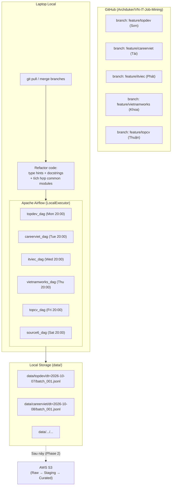

# **Implementation Plan — VN IT Job Mining Data Collection System**

## **Problem Statement:**
Xây dựng hệ thống thu thập dữ liệu tự động dùng **Apache Airflow chạy trên laptop**, orchestrate việc cào 6 trang tuyển dụng IT tại Việt Nam. Code từ các bạn bè đã có trên GitHub cần được pull về, refactor theo chuẩn (type hints + docstrings), tích hợp vào pipeline Airflow. Data lưu **local vào `data/`** trước, S3 để sau.

---

## **Requirements (Updated):**

| # | Yêu cầu | Ghi chú |
|---|---------|---------|
| 1 | Pull code crawlers từ GitHub của các thành viên về | Mỗi người có branch riêng |
| 2 | Chạy thử từng crawler, kiểm tra output | Verify HTML parsing đúng không |
| 3 | Refactor code: type hints + docstrings | Không thay đổi logic cào |
| 4 | Lưu JSONL vào `data/<source>/dt=YYYY-MM-DD/` | **Không cần S3 lúc này** |
| 5 | Airflow LocalExecutor trên laptop | SQLite backend |
| 6 | Rotating daily schedule cho 6 nguồn | Mỗi ngày 1 nguồn |
| 7 | Cào được **toàn bộ** jobs có trên trang | Pagination đầy đủ |
| 8 | Unit tests + integration tests | pytest |
| 9 | Flow cào rõ ràng, code clean | Để báo cáo thầy |

---

## **Current State (đã làm ở session trước):**

✅ Tạo cấu trúc thư mục dự án  
✅ `requirements.txt` + `requirements-dev.txt` + `pyproject.toml`  
✅ `Makefile` với các shortcuts  
✅ `scripts/setup_airflow.sh` + `scripts/install_deps.sh`  
✅ `crawlers/common/schema.py` — Pydantic models (JobMetadata, JobRaw, JobRecord)  
✅ `crawlers/common/http_client.py` — HttpClient với retry + delay + UA rotation  
✅ `crawlers/common/logger.py` + `crawlers/common/utils.py`  
✅ `tests/unit/test_schema.py` + `tests/unit/test_http_client.py`  
⬜ Chưa cài được dependencies (cần `python3.14-venv` hoặc `sudo`)  
⬜ Chưa pull code từ GitHub bạn bè  
⬜ Chưa có crawler code nào hoạt động  

---

## **Revised Architecture:**



---

## **Task Breakdown (Revised):**

---

### **Task 1: Setup môi trường — cài dependencies** `[ĐÃ CÓ SCRIPT, CẦN CHẠY]`

**Objective:** Cài đặt pydantic, pytest và các deps cần thiết trước khi làm gì khác.

**Implementation:**
- Chạy `sudo apt install python3.14-venv` → tạo `.venv` → cài toàn bộ từ `requirements-dev.txt`
- Hoặc fallback: chạy `scripts/install_deps.sh` (dùng `pip install --user`)
- Verify: `python -c "import pydantic; import pytest"` pass

**Demo:** `make test` chạy được 2 test files đã có (test_schema.py, test_http_client.py).

---

### **Task 2: Data Schema + Common Modules** `[✅ ĐÃ XONG]`

- `crawlers/common/schema.py` — Pydantic models
- `crawlers/common/http_client.py` — HTTP client
- `crawlers/common/logger.py` + `utils.py`
- `tests/unit/test_schema.py` + `test_http_client.py`

---

### **Task 3: Build thêm Common Modules còn thiếu**

**Objective:** Hoàn thiện 3 module còn thiếu trong common: `checkpoint.py`, `jsonl_writer.py`, `run.py`.

**Implementation:**
- `crawlers/common/checkpoint.py`: Class `CheckpointManager` — đọc/ghi state vào JSON file (seen_ids, last_page). Giúp resume khi interrupt
- `crawlers/common/jsonl_writer.py`: Class `JsonlWriter` — ghi JSONL an toàn, validate schema trước khi ghi, flush từng dòng, lưu vào `data/<source>/dt=YYYY-MM-DD/`
- `run.py` (root): Entry point `python run.py --source topdev --max-items 30`
- Unit tests cho cả 2 modules

**Demo:** Ghi 10 JobRecord mẫu vào `data/topdev/dt=.../batch_001.jsonl`, interrupt, resume tiếp từ checkpoint.

---

### **Task 4: Pull và audit code từ GitHub**

**Objective:** Pull toàn bộ branch của các thành viên về, chạy thử từng crawler, ghi nhận trạng thái.

**Implementation:**
```bash
# Pull từng branch về local
git fetch origin
git checkout feature/topdev
git checkout feature/careerviet
# ... etc

# Hoặc merge tất cả vào branch làm việc
git merge origin/feature/topdev
```
- Chạy thử từng file crawler gốc: `python crawlers/sources/topdev/crawler.py`
- Ghi nhận:
  - Output có đúng không (có cào được HTML không)
  - Trường nào đang lấy được, trường nào thiếu
  - Có tuân thủ delay không
  - Pagination có hoạt động không
- Tạo **Audit Report** ngắn cho từng nguồn (markdown table)

**Demo:** Bảng audit nhanh 6 nguồn: ✅ hoạt động / ⚠️ cần sửa / ❌ hỏng.

---

### **Task 5: Refactor TopDev Crawler (mẫu)**

**Objective:** Refactor crawler TopDev từ code gốc → theo chuẩn mới. Làm mẫu cho 5 crawler còn lại.

**Implementation:**
- Giữ nguyên logic parse HTML (không phá code bạn bè đã viết đúng)
- Tách ra đúng cấu trúc:
  ```
  crawlers/sources/topdev/
  ├── crawler.py   # Class TopDevCrawler kế thừa BaseCrawler, dùng common modules
  ├── parser.py    # Chỉ chứa parse logic từ code gốc → trả về JobRaw dict
  └── config.py    # URL, delay, max_items constants
  ```
- `crawler.py` phải:
  - Dùng `HttpClient` (có sẵn) thay thế `requests.get` thủ công
  - Dùng `JsonlWriter` để ghi output vào `data/topdev/dt=.../`
  - Dùng `CheckpointManager` để không cào lại tin đã cào
  - Output đúng schema `JobRecord` (JobMetadata + JobRaw)
  - Cào **tất cả pages** (pagination loop)
- Thêm type hints và docstrings
- Viết unit tests cho `parser.py` dùng HTML fixture thật (lấy từ sample HTML đã có)

**Demo:** Chạy `python run.py --source topdev --max-items 50`, xem file JSONL trong `data/topdev/`.

---

### **Task 6: Refactor 4 Crawlers còn lại (CareerViet, ITviec, VietnamWorks, + Nguồn 6)**

**Objective:** Áp dụng cùng cấu trúc Task 5 cho 4 nguồn còn lại.

**Implementation:**
- Mỗi crawler thực hiện tương tự Task 5
- CareerViet (Tài), ITviec (Phát), VietnamWorks (Khoa): refactor code có sẵn
- Nguồn 6 (Phúc): nếu code chưa có → implement mới theo BaseCrawler, chọn `vieclam24h.vn`
- Mỗi nguồn có unit test riêng cho parser

**Demo:** Chạy lần lượt 4 crawlers, mỗi cái thu thập được 50 jobs vào `data/`.

---

### **Task 7: Implement TopCV Crawler (Playwright)**

**Objective:** Crawler TopCV với Playwright để bypass Cloudflare.

**Implementation:**
- Cài `playwright` + `playwright install chromium`
- `crawlers/common/browser_client.py`: wrapper BrowserClient
- `crawlers/sources/topcv/crawler.py` dùng BrowserClient thay HttpClient
- Cùng output format JSONL vào `data/topcv/`

**Demo:** Crawl 30 jobs từ TopCV, bypass Cloudflare thành công.

---

### **Task 8: Base Crawler Abstract Class**

**Objective:** Tạo abstract class để standardize interface sau khi đã refactor xong tất cả crawlers (làm sau khi đã có real crawlers để nhìn ra pattern chung).

**Implementation:**
- `crawlers/base/base_crawler.py`: Abstract class với `run()`, `fetch_listing()`, `parse_listing()`, `fetch_detail()`, `parse_detail()`
- Refactor lại 6 crawlers để kế thừa từ BaseCrawler

**Demo:** `isinstance(TopDevCrawler(), BaseCrawler)` → True.

---

### **Task 9: Setup Airflow và tạo 6 DAGs**

**Objective:** Cài Airflow, tạo 6 DAGs với rotating daily schedule.

**Implementation:**
- Chạy `make setup` (script setup_airflow.sh)
- Tạo `airflow/plugins/crawler_operators.py`: `CrawlerOperator` wrap crawler logic
- Tạo 6 DAGs:

```python
# airflow/dags/topdev_dag.py
with DAG(
    dag_id="topdev_crawler",
    schedule="0 20 * * 1",   # Thứ Hai 20:00
    catchup=False,
) as dag:
    crawl = CrawlerOperator(task_id="crawl", source="topdev", max_items=450)
    quality = DataQualityOperator(task_id="quality_check")
    crawl >> quality
```

- Schedule:
  - Thứ Hai — TopDev
  - Thứ Ba — CareerViet
  - Thứ Tư — ITviec
  - Thứ Năm — VietnamWorks
  - Thứ Sáu — TopCV
  - Thứ Bảy — Nguồn 6

**Demo:** Airflow UI hiển thị 6 DAGs, trigger thủ công 1 DAG và xem logs real-time.

---

### **Task 10: Data Quality Check + Monitoring**

**Objective:** Thêm validation task sau mỗi crawl batch, theo dõi tiến độ qua Airflow UI.

**Implementation:**
- `crawlers/common/data_quality.py`: check record count, schema validation rate, dedup_key uniqueness
- `DataQualityOperator` trong Airflow plugins
- Dashboard đơn giản: tổng số jobs mỗi nguồn theo ngày (đọc từ JSONL local)
- Script `scripts/report.py`: in ra bảng tóm tắt tiến độ thu thập

**Demo:** Sau mỗi batch, log hiển thị "✅ topdev | 187 tin mới | 0 lỗi | 100% valid schema".

---

### **Task 11: Comprehensive Tests**

**Objective:** Hoàn thiện test suite, đạt coverage ≥ 75% cho common modules.

**Implementation:**
- `tests/fixtures/sample_html/`: lưu HTML thật từ mỗi trang để test offline
- Unit tests cho từng parser
- Integration test: mock HTTP → full crawler flow → verify JSONL output
- DAG validation tests: `airflow dags test`

**Demo:** `make test-cov` hiển thị coverage report ≥ 75%.

---

### **Task 12: Documentation + Demo Materials**

**Objective:** Chuẩn bị tài liệu và materials để báo cáo với thầy giáo.

**Implementation:**
- Update `README.md`: architecture diagram, setup guide, crawl commands
- `docs/airflow_setup_guide.md`: step-by-step setup
- `docs/demo_checklist.md`: checklist demo với thầy
- Crawl pre-demo data: 100 jobs từ mỗi nguồn, export summary table
- Slide đơn giản: architecture → Airflow DAG view → sample JSONL → job count stats

**Demo:** Trình bày với thầy: Airflow UI → trigger DAG → xem log → mở file JSONL → show stats.

---

## **Phase 2 (Sau khi thu thập đủ data — Tuần 4+):**
- Setup AWS S3, migrate từ local storage sang S3
- ELT pipeline: Raw JSONL → Staging → Curated Parquet
- Deduplication cross-source
- EDA + ML pipeline

---

## **Priority thực hiện ngay (để demo T4):**

```
Task 1 (setup env) → Task 3 (checkpoint + jsonl_writer) → 
Task 4 (pull + audit code) → Task 5 (refactor TopDev) → 
Task 9 (Airflow + 1 DAG) → Task 12 (demo materials)
```

## **Status:** Đang thực hiện full plan theo yêu cầu.