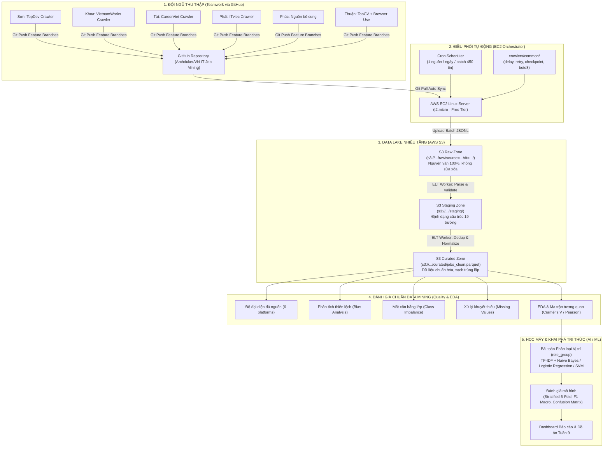

# Kiến trúc Hệ thống Pipeline Thu thập & Chuẩn Khai phá Dữ liệu
**Building a Data Collection Pipeline and Mining IT Recruitment Data in Vietnam**

> **Tài liệu phục vụ:** Báo cáo Kiến trúc & Đề cương Kỹ thuật với Giảng viên hướng dẫn  
> **Đơn vị thực hiện:** Nhóm sinh viên môn Khai phá Dữ liệu (Data Mining) — Trường ĐH Giao thông vận tải TP.HCM (UTH)  
> **Người tổng hợp:** Thuận (Leader / Data Engineer)

---

## 1. Sơ đồ Kiến trúc Tổng thể (End-to-End Architecture)

Hệ thống được thiết kế theo chuẩn **Modern Data Lakehouse** kết hợp quy trình **ELT (Extract - Load - Transform)** phân tán, giúp tách biệt hoàn toàn giữa quá trình cào dữ liệu (Extract), lưu trữ thô an toàn (Load), và làm sạch/phân loại chuyên sâu (Transform & Mine).

---

## 2. Thiết kế Chiến lược Thu thập & Batching trên EC2

### 2.1. Phân bổ lịch trình: "Mỗi ngày cào một web" (Daily Rotating Batch)
Thay vì kích hoạt đồng loạt 6 crawler làm cạn kiệt tài nguyên máy ảo và dễ bị sàn tuyển dụng nhận diện chặn IP, hệ thống áp dụng chiến lược **luân phiên mỗi ngày 1 nguồn (Daily Rotating Batch)**:

| Ngày | Nguồn cào | Người phụ trách | Quota cào/ngày | Thời gian chạy ước tính (delay 2-3s) |
|---|---|---|:---:|:---:|
| **Thứ Hai** | TopDev | Sơn | 450 | ~22 phút |
| **Thứ Ba** | VietnamWorks | Khoa | 450 | ~22 phút |
| **Thứ Tư** | CareerViet | Tài | 450 | ~22 phút |
| **Thứ Năm** | ITviec | Phát | 450 | ~22 phút |
| **Thứ Sáu** | Nguồn mới | Phúc | 450 | ~22 phút |
| **Thứ Bảy** | TopCV (Thử nghiệm) | Thuận | 150 | ~15 phút |
| **Chủ Nhật** | *Nghỉ cào & Chạy ELT tổng hợp tuần* | Toàn bộ | — | ~10 phút |

### 2.2. Tính toán mục tiêu (5 tuần thu thập dứt điểm)
- Mỗi tuần thu thập thô: $450 \times 5 + 150 \approx 2.400$ bản ghi.
- Dự trù tỷ lệ trùng lặp nội sàn & rác: $15\% - 20\%$.
- Số lượng bản ghi hợp lệ giữ lại mỗi tuần: $\approx 1.900 - 2.000$ tin.
- **Sau 5 tuần:** Đạt mốc **$10.000+$ tin tuyển dụng sạch, duy nhất**.
- **Tuần 6 đến Tuần 8:** Hoàn toàn dành thời gian cho Data Mining, Feature Engineering, Huấn luyện mô hình và xây dựng Dashboard.

---

## 3. Bộ tiêu chuẩn Đánh giá Dữ liệu theo Chuẩn Khai phá Dữ liệu (Data Mining Rigor)

Để thuyết phục hội đồng và giảng viên, bộ dữ liệu tuyển dụng không chỉ đơn thuần là "nhiều dòng" mà phải thỏa mãn các nguyên lý khắt khe của ngành Khoa học Dữ liệu:

### 3.1. Tính đầy đủ và đa dạng nguồn (Multi-source Representation)
- **Vấn đề:** Nếu chỉ cào từ một trang duy nhất (ví dụ ITviec), dữ liệu sẽ chỉ phản ánh phân khúc chuyên gia CNTT lương cao, thiếu vắng các vị trí Fresher/Junior hoặc Doanh nghiệp truyền thống.
- **Giải pháp:** Phân bổ đồng đều từ 6 nền tảng có định vị thị trường khác nhau:
  - *TopDev, ITviec:* Đại diện cho thị trường thuần Tech, công ty Product/Outsourcing lớn.
  - *VietnamWorks, CareerViet:* Đại diện cho các tập đoàn đa ngành tuyển IT (Ngân hàng, Bán lẻ, Sản xuất).
  - *TopCV:* Đại diện cho lượng lớn tin Intern/Fresher và doanh nghiệp vừa và nhỏ (SME).

### 3.2. Phân tích và kiểm soát thiên lệch (Bias Analysis & Mitigation)
Trong dữ liệu tuyển dụng CNTT Việt Nam tồn tại 3 loại thiên lệch cố hữu:
1. **Thiên lệch địa lý (Geographic Bias):** Khoảng $85\% - 90\%$ việc làm tập trung tại TP.HCM và Hà Nội.
   - *Cách xử lý:* Giữ nguyên tính khách quan của thị trường trong EDA; khi huấn luyện ML, không dùng trường `location` làm đặc trưng dự đoán `role_group` để tránh mô hình bị học vẹt vị trí theo thành phố.
2. **Thiên lệch nguồn (Platform Bias):** Mỗi sàn có cách đặt tiêu đề và mô tả khác nhau.
   - *Cách xử lý:* Sử dụng kiểm định chéo phân tầng liên nguồn (Cross-platform evaluation) để kiểm tra xem mô hình học từ tin TopDev có phân loại đúng tin trên CareerViet hay không.
3. **Thiên lệch thời gian (Temporal Bias):** Một tin đăng lại nhiều lần trong tháng.
   - *Cách xử lý:* Gắn `first_seen_date` và `last_seen_date`, khử trùng nội sàn bằng `dedup_key` ngay khi crawl.

### 3.3. Xử lý mất cân bằng lớp (Class Imbalance)
- **Thực tế khách quan:** Trong ngành IT, các vị trí **Backend, Frontend, Fullstack** luôn chiếm số lượng áp đảo ($> 60\%$), trong khi **DevOps, Data/AI, Security, QA** có số lượng tuyển dụng ít hơn nhiều.
- **Quy tắc chuẩn Data Mining:** Tuyệt đối không xóa bớt tin Backend/Frontend để "ép cho cân bằng giả tạo" vì sẽ làm mất thông tin thị trường thực tế. Thay vào đó:
  1. Sử dụng kỹ thuật chia tập dữ liệu **Stratified K-Fold Cross-Validation** (đảm bảo tỷ lệ các lớp đồng đều ở cả tập train và test).
  2. Áp dụng **Class Weights (Trọng số nghịch đảo theo tần suất lớp)** trong hàm mất mát của mô hình học máy (như Logistic Regression, SVM).
  3. Đánh giá bằng **Macro-averaged F1-Score** và **Ma trận nhầm lẫn (Confusion Matrix)** thay vì chỉ nhìn vào chỉ số Accuracy thông thường (vốn dễ bị đánh lừa khi lớp đa số chiếm ưu thế).

### 3.4. Chiến lược xử lý giá trị khuyết thiếu (Missing Values Imputation)
- **Cột Lương (`salary_min`, `salary_max`):** Trên thực tế có khoảng $60\% - 70\%$ tin tuyển dụng ghi *"Thương lượng"* hoặc *"Thỏa thuận"*.
  - *Nguyên tắc cốt lõi:* **Tuyệt đối KHÔNG gán bằng 0** (vì 0 sẽ làm sai lệch hoàn toàn biểu đồ phân phối và trung bình thống kê).
  - *Giải pháp:* Lưu trữ dưới dạng `NaN` / `null`. Khi phân tích tương quan lương và vẽ boxplot, chỉ trích xuất tập con có thông tin lương cụ thể ($N \approx 3.000 - 4.000$ tin), sau đó kiểm tra xem tập con này có bị lệch về cấp bậc so với tổng thể hay không.
- **Cột Cấp bậc (`seniority`):** Nếu tin không nêu rõ, áp dụng bộ luật trích xuất từ khóa (Heuristic Regex):
  - Chứa "thực tập", "intern" $\rightarrow$ `Intern`.
  - Chứa "fresher", "mới tốt nghiệp" $\rightarrow$ `Fresher`.
  - Chứa "senior", "lead", "trưởng nhóm" $\rightarrow$ `Senior` / `Lead`.
  - Không xác định được $\rightarrow$ Đưa về nhóm `Unknown`.

### 3.5. Ma trận Tương quan (Correlation Analysis) chuẩn cho dữ liệu Tuyển dụng
> [!NOTE]
> Giảng viên thường hỏi: *"Dữ liệu toàn chữ với danh mục thì tính ma trận tương quan thế nào?"*

Nhóm áp dụng 2 tầng tương quan chuyên biệt:
1. **Tương quan Biến định lượng (Pearson / Spearman Correlation Matrix):**
   - Áp dụng cho các thuộc tính số: `salary_min`, `salary_max`, `desc_length` (độ dài mô tả), `skills_count` (số lượng kỹ năng yêu cầu), `exp_years` (số năm kinh nghiệm trích xuất được).
   - Trực quan hóa bằng **Heatmap Correlation** để trả lời câu hỏi: *Yêu cầu nhiều kỹ năng hơn hoặc kinh nghiệm nhiều hơn thì dải lương có tăng tuyến tính không?*
2. **Tương quan Biến định danh / Phân loại (Categorical Association Matrix):**
   - Đối với các biến rời rạc như `role_group` (Nhóm vị trí), `seniority` (Cấp bậc), `location` (Thành phố): Sử dụng hệ số **Cramér's V** (dựa trên kiểm định Chi-Square $\chi^2$) để đo lường mức độ phụ thuộc giữa các biến phân loại.
   - Thể hiện sự liên hệ: *Vị trí nào thường đi kèm với cấp bậc Senior nhất? Vị trí nào tập trung chủ yếu ở Hà Nội thay vì TP.HCM?*

---

## 4. Kế hoạch Trực quan hóa Dữ liệu (EDA Visualizations)

Bộ dữ liệu hoàn chỉnh sẽ được minh họa qua **8 biểu đồ trọng tâm**:
1. **Bar Chart:** Phân bố tổng số lượng tin theo 9 nhóm vị trí (`role_group`).
2. **Horizontal Bar:** Top 20 kỹ năng công nghệ được săn đón nhất (Python, Java, React, AWS, Docker...).
3. **Heatmap:** Ma trận nhiệt kỹ năng theo từng vị trí (ví dụ: Backend cần Java/Go/SQL; DevOps cần Docker/K8s/CI-CD).
4. **Geographic Distribution:** Bản đồ tỷ lệ việc làm CNTT phân bổ giữa TP.HCM, Hà Nội, Đà Nẵng và Remote.
5. **Boxplot Dải Lương:** Phân phối mức lương (Min - Median - Max) theo từng vị trí và theo cấp bậc.
6. **Stacked Bar:** Cơ cấu cấp bậc kinh nghiệm (Intern vs Junior vs Mid vs Senior) trong từng nhóm nghề.
7. **Time-series Line Chart:** Xu hướng đăng tuyển tin mới theo các tuần trong đợt thu thập.
8. **Confusion Matrix Heatmap:** Ma trận đánh giá kết quả phân loại vị trí của mô hình Machine Learning.

---

## 5. Hợp đồng Chuyển đổi Dữ liệu ELT (Raw → Staging → Curated)

### Tầng 1: S3 Raw Zone (`s3://.../raw/`)
- Định dạng: `JSONL` (nén gzip hoặc text).
- Nguyên tắc: **Immutable (Chỉ ghi thêm, không chỉnh sửa, không xóa)**.
- Giữ nguyên văn mã HTML gốc (`description_html`) để phục vụ trích xuất lại thông tin nếu thuật toán thay đổi.

### Tầng 2: S3 Staging Zone (`s3://.../staging/`)
- Định dạng: `JSONL` có cấu trúc.
- Thực hiện: Bóc tách text, phân rã trường thông tin, loại bỏ các ký tự điều khiển, gán kiểu dữ liệu chuẩn (`datetime`, `string`, `float`).

### Tầng 3: S3 Curated Zone (`s3://.../curated/`)
- Định dạng: **Apache Parquet** (tối ưu hóa nén và tốc độ truy vấn cột bằng Pandas/DuckDB).
- Thực hiện:
  - Khử trùng lặp liên sàn (Cross-source Deduplication) dựa trên bộ khóa:
    $$\text{Hash}(\text{Công ty chuẩn hóa} + \text{Tiêu đề chuẩn hóa} + \text{Địa điểm})$$
  - Chuẩn hóa tên kỹ năng (`JS` $\rightarrow$ `JavaScript`, `k8s` $\rightarrow$ `Kubernetes`).
  - Gán nhãn phục vụ bài toán ML.
