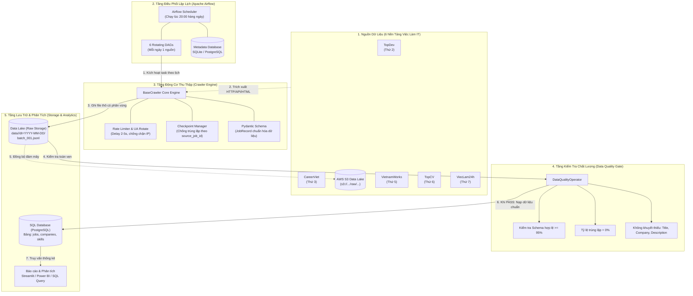

# Kiến Trúc Thu Thập Dữ Liệu Tuyển Dụng IT (Data Collection Architecture)

Tài liệu này mô tả chi tiết kiến trúc hệ thống thu thập, kiểm tra chất lượng và lưu trữ dữ liệu việc làm IT tự động của đồ án **VN-IT-Job-Mining**.

---

## 1. Sơ Đồ Kiến Trúc Tổng Thể (System Architecture)

---

## 2. Giải Thích Chi Tiết Từng Thành Phần

### Bước 1: Nguồn Dữ Liệu (Job Portals)
Hệ thống kết nối đến 6 nền tảng tuyển dụng IT lớn nhất Việt Nam:
- **TopDev, ITviec**: Chuyên biệt ngành CNTT/Lập trình viên.
- **VietnamWorks, CareerViet, TopCV, ViecLam24h**: Các trang tuyển dụng tổng hợp có số lượng tin IT rất lớn.
- **Chiến lược xoay vòng (Rotating Schedule):** Thay vì cào tất cả cùng lúc (dễ quá tải hoặc bị chặn IP), mỗi ngày trong tuần hệ thống sẽ cào một trang riêng biệt vào lúc **20:00**.

### Bước 2: Tầng Điều Phối (Apache Airflow Orchestrator)
- **Quản lý lịch trình:** Định nghĩa 6 DAGs tương ứng với 6 nguồn, thiết lập cron `0 20 * * 1` (Thứ 2) đến `0 20 * * 6` (Thứ 7).
- **Cơ chế Retry & Failure Alert:** Nếu crawler gặp lỗi mạng đột xuất, Airflow tự động thử lại sau 5 phút.
- **Airflow Metadata DB:**
  - *Hiện tại:* Dùng SQLite (`airflow.db`) gọn nhẹ, không cần cài server phụ.
  - *Mở rộng:* Dễ dàng chuyển sang PostgreSQL để chạy `LocalExecutor` song song nhiều tác vụ.

### Bước 3: Động Cơ Thu Thập (BaseCrawler Engine)
Toàn bộ crawler đều kế thừa từ class chuẩn [`BaseCrawler`](file:///home/billtran/Desktop/Learning/UTH/VN-IT-Job-Mining/crawlers/base/base_crawler.py):
1. **Lịch sự & Chống chặn (Polite Crawling):** Thiết lập delay ngẫu nhiên 2 - 5 giây giữa các lượt request, tự động xoay vòng User-Agent Header.
2. **Khử trùng lặp (Deduplication Checkpoint):** Lưu các ID tin đã từng cào vào `<source>_checkpoint.json`. Lần cào sau sẽ bỏ qua các tin đã có để tiết kiệm thời gian và băng thông.
3. **Chuẩn hóa dữ liệu với Pydantic (`JobRecord`):** Mọi tin việc làm bất kể từ nguồn nào cũng được ép về một chuẩn duy nhất gồm:
   - `_meta`: `source`, `source_job_id`, `url`, `dedup_key`, `crawled_at`, `batch_id`
   - `raw`: `title`, `company`, `salary_text`, `location_text`, `skills_text`, `description_text`, `experience_text`,...

### Bước 4: Tầng Kiểm Tra Chất Lượng (Data Quality Gate)
Sau khi cào xong, task `DataQualityOperator` sẽ kích hoạt ngay lập tức:
- Đọc file JSONL vừa sinh ra và kiểm tra:
  - Tỷ lệ đúng chuẩn Schema (phải đạt 100%).
  - Tỷ lệ trùng lặp nội bộ trong file (phải bằng 0%).
  - Các trường cốt lõi không được rỗng (`title`, `company`, `description`).
- Nếu không đạt chất lượng ➡️ Task báo Fail, dừng pipeline và gửi cảnh báo.

### Bước 5: Tầng Lưu Trữ & Phân Tích (Storage & SQL Database)
- **Tầng 1 - Data Lake (Raw JSONL):** Lưu file có cấu trúc theo ngày `data/<source>/dt=YYYY-MM-DD/batch_001.jsonl`.
- **Tầng 2 - Cloud Storage:** Sẵn sàng tải lên AWS S3 (`s3://vn-it-jobs-raw/...`).
- **Tầng 3 - SQL Database (PostgreSQL / Relational Data Warehouse):** Dữ liệu sạch được nạp vào các bảng quan hệ (`jobs`, `companies`, `job_skills`) để phục vụ chạy các câu truy vấn SQL phân tích thị trường việc làm, mức lương và kỹ năng hot.

---

## 3. Ưu Điểm Nổi Bật Của Thiết Kế Này
1. **Tính Mô-đun Hóa Cao (Modularity):** Thêm nguồn tuyển dụng mới chỉ cần viết 1 crawler kế thừa `BaseCrawler` và tạo 1 DAG mới, không ảnh hưởng đến phần còn lại.
2. **Tách biệt Data Lake & Data Warehouse:** Dữ liệu thô luôn được giữ nguyên bản (JSONL/S3) để phòng trường hợp cần parse lại, dữ liệu sạch được nạp vào SQL để phân tích.
3. **Tự Động Hóa & Đáng Tin Cậy:** Có hệ thống lập lịch tự động, kiểm tra chất lượng dữ liệu khép kín, báo cáo tức thì.
