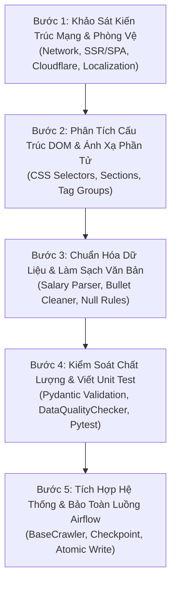

# Quy Trình Chuẩn Phân Tích & Bóc Tách Nguồn Dữ Liệu Tuyển Dụng (Universal Crawler Analysis Methodology)

> **Mục tiêu**: Hướng dẫn chuẩn hóa giúp kỹ sư dữ liệu hoặc AI Agent có thể tiếp nhận:
> 1. **Một URL nguồn tuyển dụng** (Ví dụ: `https://www.topcv.vn/viec-lam/...`)
> 2. **Một file HTML thô đại diện (DOM Snapshot)**
> 3. **Một file kết quả JSON mong muốn (Target Data Contract)**
>
> Và tự động phân tích toàn diện, xây dựng bộ bóc tách (Parser), vượt qua các cơ chế phòng vệ chống bot, làm sạch dữ liệu và kiểm thử đạt chuẩn chất lượng 100%.

---

## 1. Tổng Quan Kiến Trúc Quy Trình 5 Bước (The 5-Step Pipeline)

---

## 2. Chi Tiết Từng Bước Thực Hiện

### 🔹 Bước 1: Khảo Sát Kiến Trúc Mạng & Cơ Chế Phòng Vệ
Trước khi viết mã bóc tách, cần xác định chính xác cách thức mà trang web tải dữ liệu:
1. **Kiểm tra cơ chế Render**:
   - Dùng lệnh `curl` với User-Agent giả lập để xem phản hồi của máy chủ:
     - Nếu trả về HTML chứa đầy đủ văn bản bài viết $\rightarrow$ **Server-Side Rendering (SSR)** $\rightarrow$ Dùng `requests` hoặc `httpx`.
     - Nếu trả về HTML rỗng hoặc `div#root` $\rightarrow$ **Single Page Application (SPA / Dynamic Hydration)** $\rightarrow$ Dùng `playwright` (Chromium headless).
     - Nếu có API ngầm (XHR / Fetch) trên DevTools Network tab $\rightarrow$ Ưu tiên cào trực tiếp qua **REST API**.
2. **Nhận diện hệ thống phòng vệ chống bot (Anti-Bot WAF)**:
   - **Cloudflare Challenge / Turnstile**: Nhận diện qua chuỗi `"Attention Required! | Cloudflare"` hoặc status code 403.
     - *Giải pháp*: Sử dụng Playwright với flags `--disable-blink-features=AutomationControlled`, `--no-sandbox`, User-Agent pool xoay vòng, và context tách biệt cho mỗi request.
3. **Phân tích tham số URL & Đa ngôn ngữ**:
   - Kiểm tra xem URL có hỗ trợ query params ngôn ngữ không (Ví dụ: `?lang=en` trên TopCV).
   - Làm sạch các tracking token vô nghĩa (`utm_source`, `u_sr_id`, `ta_source`) để tránh URL bị thay đổi gây lệch cache hoặc kích hoạt bot detection.

---

### 🔹 Bước 2: Phân Tích Cấu Trúc DOM Mẫu & Ánh Xạ Phần Tử
Mở file HTML đại diện bằng `BeautifulSoup` và tiến hành ánh xạ các thành phần giao diện:

| Thành Phần Nghiệp Vụ | Vị Trí Thường Gặp | Chiến Lược Bóc Tách An Toàn (Safe Extraction) |
|:---|:---|:---|
| **Tiêu đề (`title`)** | `h1`, `.box-header-job__title` | Lấy text, loại bỏ các nhãn phụ như *"Nhà tuyển dụng đã xác thực"* |
| **Công ty (`company`)** | `.company-name-label`, `.box-company-info a` | Bỏ qua link logo rỗng, loại trừ các nút *"Xem trang công ty"* |
| **Mức lương (`salary`)** | `.box-header-job__salary` | Lấy chuỗi hiển thị gốc (Raw salary string), chuyển sang Step 3 để xử lý chi tiết |
| **Thẻ Tags/Badges** | `.job-tags`, `.tag-quickview` | **Phải phân tách theo từng nhóm Group Name** (xem Step 3) |
| **Mô tả công việc** | `.box-job-information-detail-item` | Quét tiêu đề H2 (song ngữ: Mô tả công việc / Job Description) |
| **Yêu cầu ứng viên** | `.box-job-information-detail-item` | Quét tiêu đề H2 (Yêu cầu ứng viên / Candidate Requirements) |
| **Quyền lợi ứng viên** | `.box-job-information-detail-item` | Quét tiêu đề H2 (Quyền lợi / Benefits) |
| **Thông tin chung** | Key-Value list | Bóc tách cặp nhãn - giá trị: Kinh nghiệm, Cấp bậc, Học vấn |

---

### 🔹 Bước 3: Chuẩn Hóa Dữ Liệu & Quy Tắc Làm Sạch (Data Cleaning Pipeline)

#### 1. Chuẩn Hóa Mức Lương (`JobSalary`)
Mức lương không được lưu trữ dưới dạng text thô mà phải phân tách thành đối tượng lồng:
- **Dải lương số (`salary_min`, `salary_max`)**: Quy đổi về cùng đơn vị triệu VNĐ (hoặc USD).
  - *"15 - 25 triệu"* $\rightarrow$ `min=15.0, max=25.0, currency="VND"`
  - *"Tới 40 triệu"* $\rightarrow$ `min=null, max=40.0, currency="VND"`
  - *"Từ 20 triệu"* $\rightarrow$ `min=20.0, max=null, currency="VND"`
  - *"Up to 1,500 USD"* $\rightarrow$ `min=null, max=1500.0, currency="USD"`
- **Chu kỳ trả lương (`pay_period`)**: Tự động nhận diện `"month"` (tháng), `"year"` (năm), `"day"` (ngày), `"hour"` (giờ).
- **Cờ thỏa thuận (`is_negotiable`)**: `True` nếu chứa *"Thỏa thuận"*, *"Cạnh tranh"*, *"Negotiable"*.
  - *Mẹo nâng cao*: Nếu mức lương hiển thị là *"Thỏa thuận"* nhưng tiêu đề có ghi mức lương (Ví dụ: *"Dev C# Lương Upto 40 Triệu"*), crawler tự động fallback quét regex trong tiêu đề.
- **Cờ hoa hồng / thu nhập biến đổi (`has_commission`)**: `True` nếu có chứa từ khóa *"hoa hồng"*, *"thưởng KPI"*, *"commission"*, *"thu nhập lên tới"*.

#### 2. Phân Tách 3 Nhóm Thẻ Tags (`JobTags`)
Tuyệt đối không gộp chung toàn bộ tags vào một mảng phẳng. Khối `.job-tags` phải được chia thành 3 trường:
- `requirements`: Thẻ tag từ nhóm **Yêu cầu** (Ví dụ: `["3 năm kinh nghiệm chuyên môn", "Đại Học trở lên", "Tiếng Anh TOEIC 650"]`).
- `benefits`: Thẻ tag từ nhóm **Quyền lợi** (Ví dụ: `["Bảo hiểm xã hội", "Bảo hiểm sức khỏe"]`).
  - **Quy tắc gán `null`**: Nếu bài đăng không có nhóm thẻ quyền lợi $\rightarrow$ `benefits: null`.
- `skills`: Thẻ tag từ nhóm **Chuyên môn** (Ví dụ: `["Business Analyst", "IT - Phần mềm"]`).

#### 3. Làm Sạch Danh Sách Dòng Văn Bản (`list[str]`)
- Tuyệt đối loại bỏ `\n` và các đoạn mã HTML thô.
- Bóc tách từng dòng sạch bằng hàm `text_to_clean_lines`:
  - Tìm các thẻ `<li>` hoặc tách theo dấu xuống dòng `\n`.
  - Dùng regex loại bỏ toàn bộ ký tự bullet rác ở đầu dòng: `•`, `-`, `*`, `+`, `1.`, `2)`.
  - Loại bỏ các dòng quá ngắn hoặc chỉ chứa ký tự đặc biệt.

---

### 🔹 Bước 4: Kiểm Soát Chất Lượng & Viết Unit Test Tự Động
1. **Kiểm tra tính hợp lệ qua Pydantic Model (`JobRecord`)**:
   - Tất cả bản ghi thu thập bắt buộc phải khởi tạo thành công qua `JobRecord.model_validate(record)`.
2. **Kiểm tra chất lượng dữ liệu với `DataQualityChecker`**:
   - Lưu một tập benchmark gồm 5-10 jobs đại diện vào `test_N_jobs.json`.
   - Chạy kiểm tra:
     - Tỷ lệ hợp lệ schema: **100%**.
     - Tỷ lệ khóa duy nhất `dedup_key`: **100%**.
     - Không được rỗng tiêu đề (`title`), công ty (`company`), và mô tả (`description_list`).
3. **Bộ Unit Test bắt buộc**:
   - Test trích xuất lương (dải lương VND, USD, thỏa thuận, hoa hồng).
   - Test phân loại nhóm thẻ tags và trường hợp `benefits: null`.
   - Test làm sạch dòng văn bản bullet points.

---

### 🔹 Bước 5: Tích Hợp Hệ Thống & Bảo Vệ Luồng Airflow
1. **Kế thừa `BaseCrawler` chuẩn**:
   - Triển khai hàm `fetch_items() -> Generator[dict, None, None]`.
   - Triển khai hàm `parse_item(item: dict) -> JobRecord | None`.
2. **Bảo toàn 100% Luồng Airflow**:
   - Không thay đổi tên class, signature hàm khởi tạo `__init__(checkpoint_dir, output_dir, max_items)`.
   - Không sửa đổi mã nguồn trong thư mục `airflow/` (`crawler_dags.py`, `crawler_operators.py`).
3. **Cấu hình Cache & Tối Ưu Lưu Trữ**:
   - Mặc định đặt `save_html = False` để tránh phình dung lượng ổ cứng.
   - Khi cần phân tích mẫu mới bật cờ `--save-html`.
