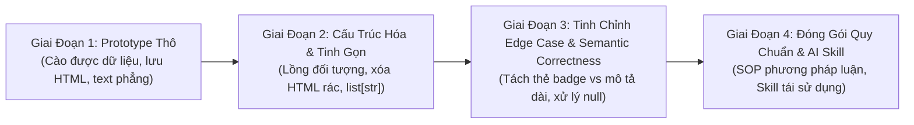

# Nhật Ký Prompt Thực Chiến & Phân Tích Diễn Tiến Tư Duy (User Prompt Logs & Evolutionary Insights)

Tài liệu này ghi lại toàn bộ chuỗi Prompt thực tế của Người dùng (Product Owner / Data Engineer) trong quá trình nghiên cứu, chuẩn hóa cấu trúc dữ liệu và phát triển crawler cho TopCV. Từ chuỗi prompt này, chúng ta đúc kết ra mô hình tư duy chuẩn mực giúp AI có thể tự động tiếp nhận và giải quyết các bài toán bóc tách dữ liệu tương tự.

---

## 1. Nhật Ký Toàn Bộ Các Prompt Thực Tế

### 📌 Prompt 1: Đặt Vấn Đề & Brainstorm 4 Điểm Cải Tiến Cốt Lõi
> **User Prompt:**
> ```text
> /plan tui thấy 4 vấn đề nên khắc phục như thế này bạn thấy barinstom lại nha:
> 1. nếu như top cv có đường link /en thì sao: https://tuyendung.topcv.vn/en tìm thử đi
> 2. tui thấy fortmat chưa chuẩn tui nghĩ nên như chuẩn sẽ :
>    "salary": {
>      "salary_text":"",
>      "salary_min": "",
>      "salary_max": "",
>      "salary_currency": "",
>      "pay": "month", year, day // cái này tui chưa biết làm sao
>      "..": ... // .. ở đây là có hoa hồng kiểu thu nhập max sẽ à chưa biết và cso ư kết quả là true/false
>    }
> 3. tui nghĩ thêm một cái là 
>    "tag": {
>      requirment: ["", ""]
>      benefits: "", ""
>      ..: "", "" : là chuyên môn á 
>    }
> 4. còn lại tui thấy là ổn có đều tag\n thì mình nên làm đưa về dặng list string ["",""] thì sao 
> Ở đay thì hãy đưa ra mopkt plan đề xuất giải pháp trước đi thêm một đonạ ở trong file crawlers/sources/topcv/INSTRUCTION_ANALYSIS.md/plan
> oke tạo ra plain đi dồi nhớ nha tạo ra gì thì phải lưu ý là cái luồng từ động dã tihcs hợp airflow của tui nó vẫn còn trong file crawlers/sources/topcv hơn nữa thay điỏ schema luôn thì phải thông báo đã thay đổi gi 
> rules: là không thay đổi luồng hoạt động của airflow chỉ tham gia vào việc thay đổi cách cào của topcv thôi.
> ```

#### 🔍 Phân Tích & Phản Xạ Của AI:
- **Vấn đề 1 (URL `/en`)**: Kiểm tra thực tế phát hiện `tuyendung.topcv.vn/en` là portal B2B của nhà tuyển dụng (đăng tin), không phải trang tìm việc cho ứng viên. Tuy nhiên, TopCV hỗ trợ đa ngôn ngữ trên bài tuyển dụng thông qua query param `?lang=en`. Parser cần hỗ trợ song ngữ (cả tiếng Anh lẫn tiếng Việt cho các khối nội dung).
- **Vấn đề 2 (Cấu trúc lương lồng nhau)**: Xây dựng model `JobSalary` gồm: `salary_text`, `salary_min`, `salary_max`, `salary_currency`, `pay_period` ("month", "year", "day", "hour"), `is_negotiable` (thỏa thuận), và `has_commission` (hoa hồng / biến đổi).
- **Vấn đề 3 (Phân nhóm thẻ `tag`)**: Bóc tách các thẻ badge thành 3 nhóm có ý nghĩa nghiệp vụ: Yêu cầu, Quyền lợi, Chuyên môn.
- **Vấn đề 4 (Làm sạch `\n` thành `list[str]`)**: Viết hàm `text_to_clean_lines` bóc tách từng dòng bullet hoặc thẻ `<li>`, loại bỏ ký tự đầu dòng rác (`•`, `-`, `*`, `1.`, `2)`).
- **Quy tắc bất biến (Airflow Safety Rule)**: Không can thiệp hay thay đổi interface của Airflow DAGs và Operators (`crawler_dags.py`, `crawler_operators.py`).

---

### 📌 Prompt 2: Tinh Gọn Data Contract (Compact Schema) & Tắt HTML Cache
> **User Prompt:**
> ```text
> /plan oke tuyệt vời nhma ở đây bạn vui lòng đề ra kế hoạch chỉnh schema.py và crawler.py giúp minh với <context>
> <tasks> Thu gọn lại cấu trúc schema.py đi với việc bỏ các fearture sau:
> "description_html": xóa  
> "description_text": -> "description_list":
> salary chỉ giữ phần này thôi còn lại xóa nha cái salary :{} 
> cái nào có list thì xóa phiên bản text nha   
> còn crawler thì dừng xuất các file.html nha không cần lưu html nữa vì đã xuất đủ rồi -> đề xuất ra cách tắt chức năng đó 
> <tasks>
> <rules> ở đây mình ần miêu tả củ thể schema 
> hãy xuất cho tui file.md để plain cho các bước ở trên 
> miêu tả cụ thể và rõ ràng cho tui nha 
> <rules>
> ```

#### 🔍 Phân Tích & Phản Xạ Của AI:
- **Tối ưu dung lượng lưu trữ (Payload Minimization)**:
  - Loại bỏ hoàn toàn `description_html` vì HTML thô chiếm tới 70-80% dung lượng file JSON và chứa nhiều thẻ rác styling.
  - Xóa bỏ các trường phẳng cũ: `salary_text`, `salary_min`, `salary_max`, `salary_currency` ở root, gom tất cả vào `salary: JobSalary`.
  - Thay thế `description_text`, `requirements_text`, `benefits_text`, `skills_text` bằng các mảng sạch: `description_list`, `requirements_list`, `benefits_list`.
- **Cơ chế tương thích ngược (Backward Compatibility)**:
  - Khi xóa các trường cũ, các crawler khác và test suite cũ sẽ bị ảnh hưởng nếu không xử lý khéo léo.
  - **Giải pháp kỹ thuật xuất sắc**: Sử dụng `@model_validator(mode="before")` (`migrate_legacy_fields`) trên `JobRaw` để tự động chuyển đổi dữ liệu legacy sang định dạng compact mới và pop các key cũ; đồng thời trang bị `@property` getters (`salary_min`, `description_text`,...) để code truy cập trực tiếp không bị vỡ.
- **Tắt tạo file HTML**: Đổi mặc định `save_html = False` trong `TopCVCrawler` và thêm flag CLI `--save-html default=False`.

---

### 📌 Prompt 3: Phát Hiện Lỗi Bóc Tách Job ID `2157137` & Xử Lý Quyền Lợi Null
> **User Prompt:**
> ```text
> /plan <div class="box-job-information-detail-item">
>     <div class="box-job-information-detail-item__title">
>         <h2 class="box-job-information-detail-item__title--title">
>             Tổng quan
>         </h2>
> ...
>     <div class="job-tags">
>         <div class="job-tags__group">
>             <h3 class="job-tags__group-name">Yêu cầu:</h3>
>             <div class="job-tags__group-list-tag">
>                 <a class="item search-from-tag ">3 năm kinh nghiệm chuyên môn</a>
>                 <a class="item search-from-tag ">Đại Học trở lên</a>
>                 <a class="item search-from-tag link">Tiếng Anh TOEIC 650</a>
>                 <a class="item search-from-tag link">Tiếng Anh IELTS 6.0</a>
>             </div>
>         </div>
>         <div class="job-tags__group">
>             <h3 class="job-tags__group-name">Chuyên môn:</h3>
>             <div class="job-tags__group-list-tag">
>                 <a class="item search-from-tag link">Business Analyst (Phân tích nghiệp vụ)</a>
>                 <a class="item search-from-tag link">IT - Phần mềm</a>
>             </div>
>         </div>
>     </div>
> </div>
> check giùm tui id 2157137 vì ở đây phần tag chỉ có nhiêu đây nhma bạn cào sai phàn khung rồi ạ ở chỗ requirment và benefit thì ở đây tui nghĩ nên chỉnh lại phần tag vì tag có 3 phần: yêu cầu, quyền lợi, chuyên môn y như html trên đó á nên hãy giúp tui đề plan đối với schema.py và crawler gòi để giải quyết vấn đề trên đi
> ooke ở đây có nhóm quyền lợi nè hay gips tui thêm cái này cho có đủ quyền lợi đi một số page hem có thì để quyền lợi là null
> ```

#### 🔍 Phân Tích & Phản Xạ Của AI:
- **Phát hiện Bug quan trọng**:
  - Trong logic cũ của `crawler.py`, biến `tags_data["requirements"]` bị gán nhầm bằng `req_list` (nội dung chi tiết 10 bullet dài của bài viết), và `tags_data["benefits"]` bị gán nhầm bằng `ben_list` (nội dung chi tiết 15 bullet dài).
  - Điều này làm `tags` bị phình to vô nghĩa và trùng lặp 100% với các trường mô tả chi tiết ở cấp `raw`.
- **Nhận diện bản chất của TopCV Tag Container**:
  - Khối `.job-tags` thực tế chỉ chứa các chip/badge ngắn phục vụ việc lọc và tìm kiếm nhanh.
  - TopCV chia khối này thành đúng 3 nhóm: **Yêu cầu**, **Quyền lợi**, và **Chuyên môn**.
- **Quy tắc gán `null` (Crucial Edge Case Rule)**:
  - Nếu bài tuyển dụng có nhóm thẻ Quyền lợi (như Job ID `2316770` Sun Vigor có `['Bảo hiểm xã hội', 'Bảo hiểm sức khỏe']`), thì trích xuất danh sách thẻ đó.
  - **Nếu bài tuyển dụng không có nhóm thẻ Quyền lợi (như Job ID `2157137`), trường `tags.benefits` PHẢI là `null` (`None`)**, không được để mảng rỗng hay nhồi nhét text mô tả.

---

## 2. Mô Hình Tư Duy Tiến Hóa (Evolutionary Thinking Model)

Từ 3 bước prompt trên, ta có thể rút ra một kim chỉ nam rõ ràng cho quá trình phát triển bất kỳ hệ thống thu thập dữ liệu nào:



### 3 Bài Học Cốt Lõi Cho AI Agent:
1. **Luôn phân tích DOM trực tiếp từ HTML thực tế trước khi kết luận**: Không bao giờ giả định một trang web chỉ có 1 kiểu hiển thị. Phải crawl thử các mẫu đa dạng (có lương/lương thỏa thuận, có thẻ quyền lợi/không có thẻ quyền lợi, tiếng Anh/tiếng Việt).
2. **Phân biệt rạch ròi giữa Tag/Metadata và Detailed Content**:
   - `Tag`: Ngắn gọn (1-5 từ), dạng chip/pill, dùng để faceting/filter tìm kiếm.
   - `Content`: Dài (câu, đoạn, bullet points), dùng cho NLP, Search Fulltext, LLM Embedding.
3. **Tuân thủ nguyên tắc "Strict Input, Flexible Migration"**: Khi cải tiến schema, luôn trang bị validator tự động chuyển đổi dữ liệu cũ để không làm gãy pipeline của các nguồn khác trong hệ thống.
